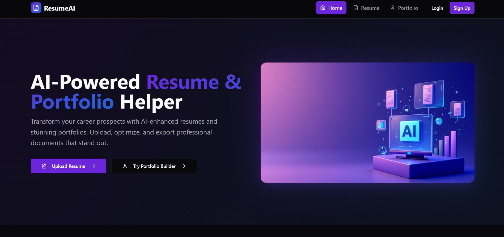

#  Smart Resume & Portfolio Helper 🚀

An intelligent, full-stack application designed to help students and professionals create, enhance, and showcase their career materials using AI. This tool provides AI-powered suggestions to improve resumes and generates beautiful, multi-themed portfolio websites in minutes.

**[🔗 Live Demo Link](https://smart-resume-helper.vercel.app/)** 

---

## ✨ Key Features

* **AI Resume Enhancement**: Upload your resume (PDF, DOCX, TXT) and get an improved, ATS-friendly version rewritten by AI. It focuses on strong action verbs, quantifiable achievements, and professional formatting.
* **Multi-Theme Portfolio Builder**: Fill out a simple form with your professional details and projects, and instantly generate a stunning, single-page portfolio website.
* **Choice of Professional Themes**: Select from multiple professionally designed themes (Minimalist, Tech, Creative) to match your personal brand.
* **Secure User Authentication**: A full registration and login system ensures that all your saved portfolios are private and accessible only to you.
* **Save & Load Functionality**: Save your generated portfolios to our database and load them back into the editor at any time to continue your work.

---

## 📸 Screenshots

Here's a look at the application in action:

| Landing Page | Resume Enhancer | Portfolio Builder |
| :---: | :---: | :---: |
|  |  |  |


---

## 🛠️ Tech Stack

This project is a full-stack application built with a modern, scalable tech stack.

### Frontend
* **Framework**: [React](https://reactjs.org/) (with [Vite](https://vitejs.dev/))
* **Language**: [TypeScript](https://www.typescriptlang.org/)
* **Styling**: [Tailwind CSS](https://tailwindcss.com/)
* **UI Components**: [shadcn/ui](https://ui.shadcn.com/)
* **Routing**: [React Router](https://reactrouter.com/)

### Backend
* **Framework**: [FastAPI](https://fastapi.tiangolo.com/)
* **Language**: [Python](https://www.python.org/)
* **AI Integration**: [Google Gemini API](https://ai.google.dev/)
* **Database**: [SQLite](https://www.sqlite.org/index.html) (with [SQLAlchemy](https://www.sqlalchemy.org/))
* **Authentication**: JWT Tokens with Passlib for password hashing

### Deployment
* **Frontend**: Deployed on [Vercel](https://vercel.com/)
* **Backend**: Deployed on [Render](https://render.com/)

---

## 🚀 Getting Started Locally

To get a local copy up and running, follow these simple steps.

### Prerequisites

* Node.js & npm
* Python & pip
* A Google AI API Key

### Installation & Setup

1.  **Clone the repository:**
    ```sh
    git clone https://github.com/QuintessenceCoding/smart-resume-helper.git
    cd smart-resume-helper
    ```

2.  **Backend Setup:**
    ```sh
    cd backend
    python -m venv venv
    # Activate the virtual environment (Windows)
    .\venv\Scripts\activate
    # Or (Mac/Linux)
    source venv/bin/activate
    pip install -r requirements.txt
    ```
    Create a `.env` file in the `backend` folder and add your Google API key:
    ```
    GOOGLE_API_KEY="your_api_key_here"
    ```

3.  **Frontend Setup:**
    ```sh
    cd ../frontend
    npm install
    ```
    Create a `.env` file in the `frontend` folder and point it to your local backend:
    ```
    VITE_API_BASE_URL=http://localhost:8000
    ```

4.  **Run the Application:**
    * In your backend terminal, run: `uvicorn main:app --reload`
    * In your frontend terminal, run: `npm run dev`

Your application should now be running locally!

---

## 🌟 Future Improvements

This project has a solid foundation, but there are many exciting features that could be added:
* [ ] **More Portfolio Themes**: Add more creative and professional themes for users to choose from.
* [ ] **Custom Domain Hosting**: Allow users to connect their own domain names to their generated portfolios.
* [ ] **Resume Templates**: In addition to enhancing text, provide different visual resume templates.
* [ ] **PostgreSQL Migration**: Upgrade the database from SQLite to a more robust solution like PostgreSQL for production.

---

## 📄 License

Distributed under the MIT License. See `LICENSE` for more information.